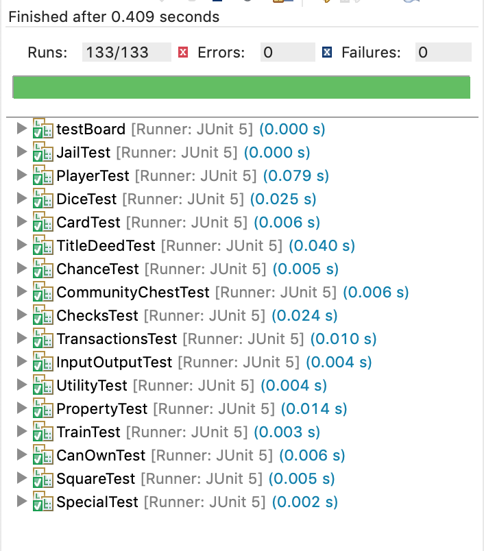
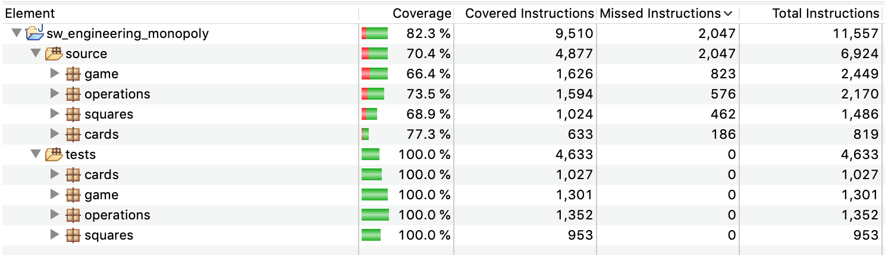
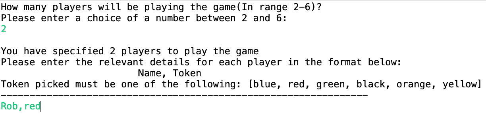
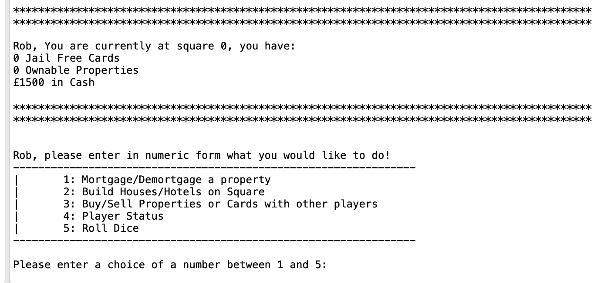
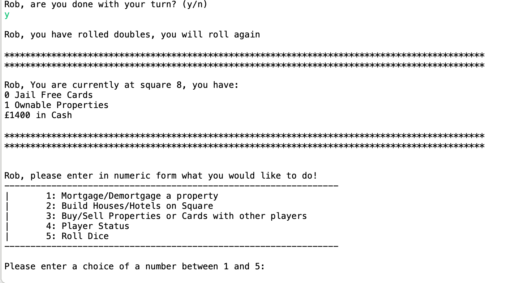
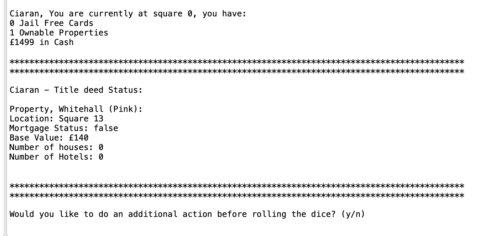
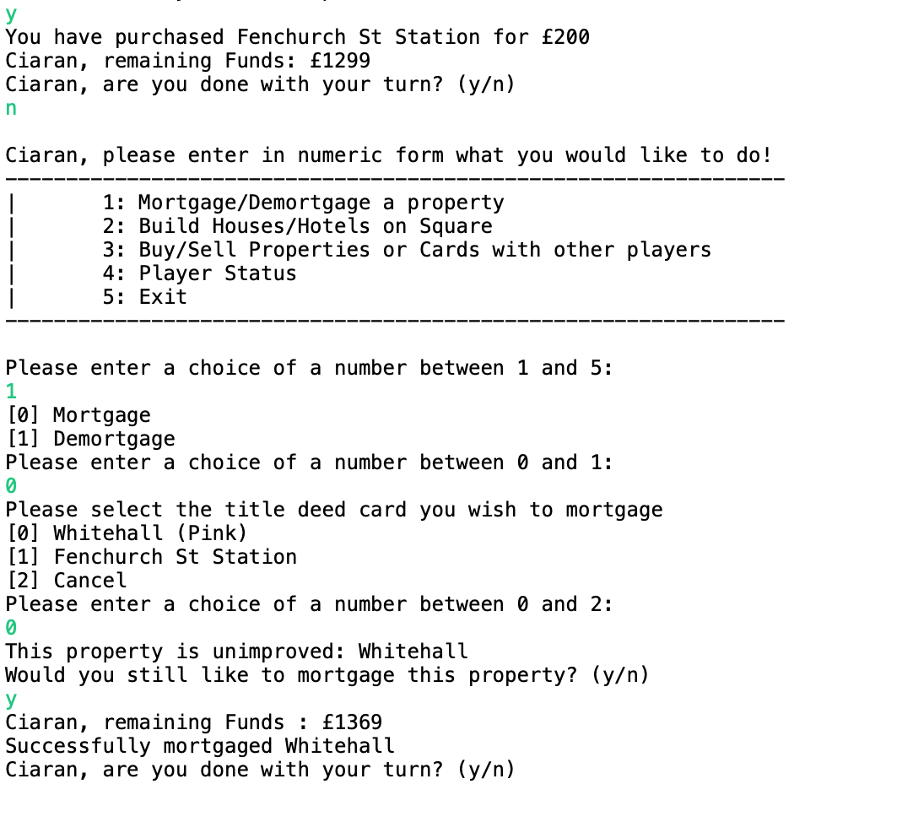
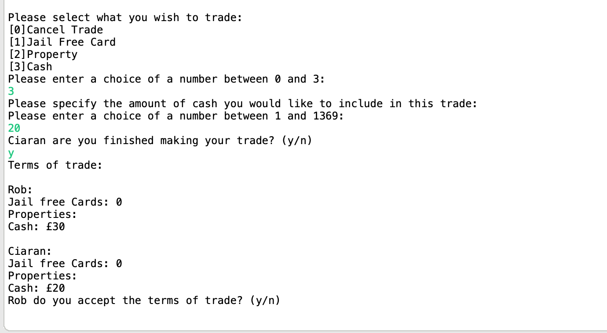
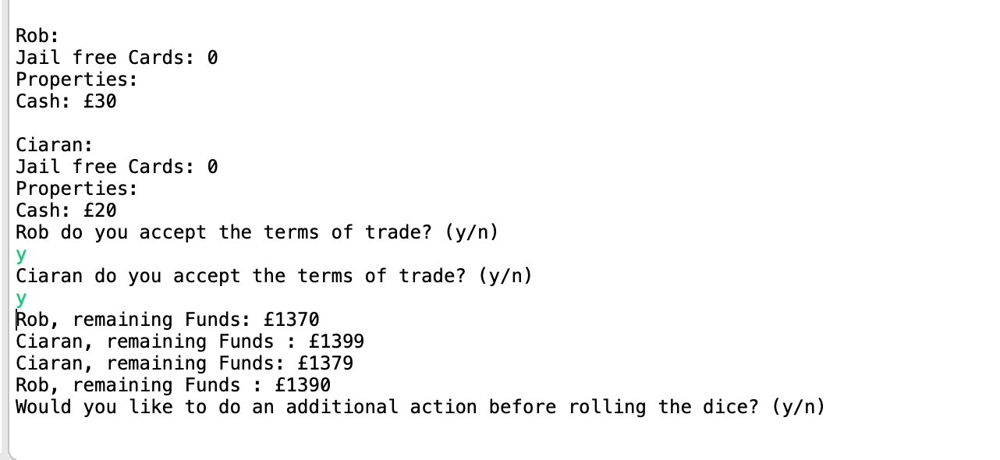
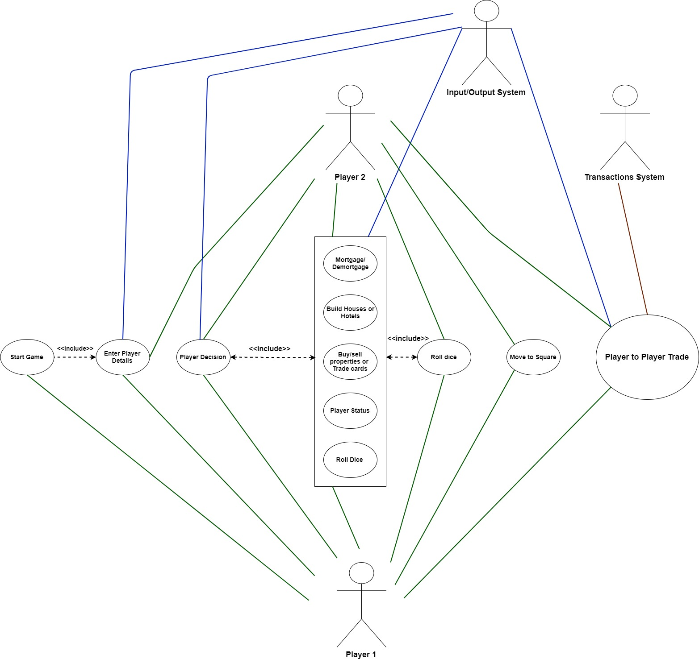

# (COMP41670) Software Engineering Final Project Description 
## Team members: Robert Keenan (15333066) & Ciaran Nolan (15329936)
## Team ID: 11

* The aim of this assignment is to create a fully functional version of the board game Monopoly using Java.
* This repository will contain all the functional code required to run this game.
* The objective of this variant of Monopoly is to own as much land as possible and be the richest person in the game.
* With respect to property names and chance and community chest cards, we implemented the UK version of the game. The property rents can be seen for the UK version at this link: [UK Monopoly Properties](http://www.jdawiseman.com/papers/trivia/monopoly-rents.html). For further details, you can see our configuration files which describe them in full in the following folder, source/gameConfigurations.
* Please see our JavaDoc in our repository for more in-depth details into the structure of our project and the implementation for all methods and classes
* NOTE: We had problems with UTF-8 coding of the £ symbol when printing to the console with different text encoding schemes in Eclipse between computers (macOS vs Windows). **Please ensure your text encoding is UTF-8 in your IDE.**
## Structure of the Repository
* The repository is firstly split into 2 main folders of Java code:
	* source: Contains all of the source code in a number of packages.
	* tests: Contains all of our unit tests for each one of our source code classes in the source/ folder.
* There are a number of other folders such as _UML Diagrams/_ (for UML Class, Use Case and Sequence Diagrams), _Images/_ (Of Test results and general workflow) and _doc/_ (which contains all of the Javadoc. It is split into source (Javadoc for source code) and tests for test code)

#### Source Code 
* Each one of these 2 main folders is split into a number of packages which are described below in terms of why we structured them that way:
	* **cards: The *cards* package contains all of the relevant cards to play the game. These are the cards that will be physically used in the game and the Card parent class**
	* **Card.java**: Card abstract class (parent class).
		* **Chance.java**: The implementation of Chance cards.
		* **CommunityChest.java**: The implementation of Community Chest cards.
		* **TitleDeed.java**: The Title Deed cards that are associated with a site or square on the board that can be bought by a player. Players trade and buy/sell Title Deed cards rather than the Square on the board itself. This means that we have implemented a method similar to how Monopoly is played in reality.
	* **game: The *game* package contains all of the relevant classes for the game physically such as the Main Game file, the board and other classes as shown below**
		* **Board.java**: This contains all of the source code to set up the board. It reads the configuration of the board from the gameConfiguration files and initialises the board. 
		* **Dice.java**: The dice file which contains all the functionality for the 2 Die used in the game of Monopoly such as rolling the dice, counting double rolls, etc.
		* **Game.java**: This is our Main file where the game is played
		* **Jail.java**: Handles all of a player's interactions with jail
		* **Player.java**: A large class which handles all of a player's interactions with the game such as paying rent, reducing/adding money to their account, moving around the board and all of the operations involved in bankruptcy
	* **gameConfigurations**: This file is unique as we import all of the data for properties, train stations, utilities, chance cards, community chest cards and special squares. They are all in a set structure so somebody could use the American version of Monopoly's properties with our code and it would work provided the structure of the configuration files was the same. We did this to improve the extensibility of our design.
	* **operations: This package contains a number of operations files which we thought would be best kept separate. These include methods that are checking various outputs and class variables, Input/Output functionality and a class for transactions between players**
		* **Checks.java**: A number of methods that are used to check various aspects of the game such as players, distribution of houses and whether you own all properties of a certain colour for example.
		* **InputOutput.java**: We found we were repeating a lot of the same input and output functionality so we made a class out of a number of methods such as yes no inputs and integer menus
		* **Transactions.java**: Covers a wide array of Transactions between players
	* **squares: This covers all of the squares that will be on the board and their attributes on the board such as their location or name/description**
		* **CanOwn.java**: A CanOwn object is a Square on the board that can be owned such as a Property, Train station or Utility
		* **Property.java**: A square which can have houses and hotels built on it
		* **Special.java**: A special square is one such as Free Parking, Tax, Income, Chance or Community Chest card square, Jail or Go
		* **Square.java**: The overall parent class to all squares
		* **Train.java**: Train station class
		* **Utility.java**: Utility class

#### Test Code
* The test code is stored in a separate folder (**sw_engineering_monopoly/tests**) at the project level (it is not in the source folder). 
* We proposed this as we could keep our test and source code separate for when we were examining coverage analysis in Eclipse and also when creating the JAR file
* The tests folder contains the same 4 packages as our source code and this was done as we could keep any methods and variables **package private** in our source code and not need to make them public just for testing.
* This is desirable as you don't want the tests to interfere or jeopardise the integrity of your code structure.
* Test code can be run from the top level project by pressing right click "Run as > JUnit Test"
* We take no user input in our unit tests. With purely non-user interacting functions, we would have never have been able to achieve sufficient coverage of the code base and determine that each method was working correctly together. 
	* To do this, we added a `BufferedReader` to the arguments of any methods that needed user input. As a result, we could set a String into the input buffer so that our tests all run automatically without user input which is desirable.
	* Without this feature, some of our tests such as playerAuction would take nearly 5mins to type in all the relevant details to cover all of the relevant test cases
	* We decided this was a better structure to have in such a user-centric project/game such as Monopoly where user input is required all of the time.
* `BufferedReader` example in a test for creating a player list:
```java
String instruction1 = "2\r\nRob,red\r\nCiaran,blue\r\n";
InputStream instructionInputStream = new ByteArrayInputStream(instruction1.getBytes());
System.setIn(instructionInputStream);
Game.playerList = InputOutput.createListPlayers(null);
```
* The final code coverage and performance of our tests are shown below. We have 132 tests in total and there is a test for every class apart from the Game class which is our Main file. Firstly we will show all tests passing and then followed by 70.4% code coverage of the source code.




#### UML Diagrams 
* UML Diagrams are located in the folder at the top level of the project called "UML Diagrams". Inside of this folder, you can find the following diagrams which are saved as .xml, .jpg image and .ucls which is an ObjectAid Class Diagram.
	* **Class Diagram** (Class Diagram.jpg, Class Diagram.ucls): For the whole structure of our code and classes complete with interface (Printable) and Dice (Singleton Design Pattern).
	* **Sequence Diagram** (Sequence.jpg, Sequence.xml): 
		* This sequence diagram handles the rolling of a dice for a player called Player1, they land on a Property owned by Player2. Player2 requests rent and when Player1 goes to pay, they cannot so they go bankrupt. The property owned by Player1 is transferred to Player2 by transferring its Title Deed card. 
		* The alternate path is shown at the bottom which is where rent is requested and Player1 is able to pay it this time and it reduces their balance of money
	* **Use Case Diagram** (Use_Case.jpg, Use_Case.xml):
		* The Use case diagram we have done is very simple, we have not covered all of the aspects of the code understandably and have more so covered the initial set-up of a game and then the Player to Player trading. 
		* 4 Objects are defined (Player 1, Player 2, Input/Output System, Transactions System)
		* <<include>> shows shared functionality between the use cases and any solid lines describe an interaction or connection to the use case or system in place
		* For example, for the player to player trade use case 2 players take part in the trade so their green lines point to the trade use case bubble. The transactions system and input/output system are also involved in this use case represented by blue and brown lines respectively and as a result, they contribute to the use case also
		* To reiterate, **Green** lines represent player interaction with use case, **brown** lines are transaction system interactions and **blue** lines are Input/Output system interactions with Use cases
		
#### Images
* We took a number of images to demonstrate our testing performance and also how to run a simple process or use case through the main Game.java file.
* These are located in the **Images** folder in the Project directory.

#### Reason for Configuration files
* We implemented configuration files in a set format or structure as we wanted our code and project to be as transferable as possible so that a user could perhaps use their own configuration files for their own custom version of Monopoly. This could include our code being used for the Irish, UK and US versions of Monopoly with only a few simple changes needed. We used this as a motivation to demonstrate the extensibility and user-friendliness of our code base. 

## How to run the project successfully
* We will present in this section a very simple flow to using the project

### Initial Setup of Game and Players
* Enter the number of players and their Names and Tokens (colours) in the format of `Name,token`


### Initial Choice for the Player
* A player is then presented with the following choice to make and they enter an integer choice


### Rolling a Dice
* Choosing Integer choice 5, you roll the dice and presented with the following for example


* Rolling a double presents you with the following


### Buying a Property and Title Deed Status
* If you purchase a property, your Title Deed list will be updated as shown for the player Ciaran


### Mortgaging a Property you own
* In the case of the player Ciaran who owns Whitehall, they can mortgage it as shown


### Trading with other Players
* You can trade with other players at any time so long as it is your turn. You can trade money, Properties/Train Stations/Utilities or a Get out of Jail free card.
* Both players are prompted for terms of the deal and then they must both agree to accept the trade as shown below in the images



		
## Teamwork
* We initially set up a number of ways to communicate and make sure that we were working on different aspects of the project that would lead to minimal interference in pushed code.
* We started off with a number of white board meetings in the Library to decide on our class structure, class variables, initial class methods for each and our design methods.
* We use Trello to assign ourselves debugging tasks, merge requests from other branches (also assigned through Gitlab) and setting out tasks for each of us. We found this is an extremely good tool to use when we are working remotely away from each other and we have both used it in a professional setting before so we were quite familiar with its advanced features.
* We prioritised working on branches for improving the workflow but also separating Master from substantial changes to functionality. This was made most obvious by the TitleDeedChanges branch which was used to implement the changes of exchanging TitleDeed cards instead of the physical Property square when you were buying or selling. This was to make it as accurate as possible to the real game. Branches were used to protect master before assigning merge requests to the other member of the team
* Through Trello, we can gain an insight into what each other is doing but also ensures that we are not doing the same tasks twice.
* We also consistently meet up in the Engineering building to see what each other has done and how we can progress with the project as a whole. We actually sit beside each other in the ME Project Lab in the Engineering building so it is easy for us 
* Once we were finished with a class, we would meet up and review the code. From here, we could make judgements on areas where we could improve, optimise the speed of our program or simplify the structure.
* As you may have noticed from our Gitlab repository, there is a large number of commits. We have obviously seen in this Software Engineering module just how important Agile methodologies are to the efficient performance of a software development team. We emphasised incremental improvements with many commits a day. This meant that there was a minimal amount of times where we had merge conflicts or encountered issues in our workflow and this is definitely something we prioritised throughout the project
* You may also notice when you look at the contributors for our Gitlab repository in Repository > Contributors that there are 4 separate main contributors. This is due to us both using 2 different computers to push changes to the code base

## Appendix UML Diagrams
* I will put these UML Diagrams here as an Appendix for reference
* Class Diagram:


* Sequence Diagram:


* Use Case Diagram:




		
